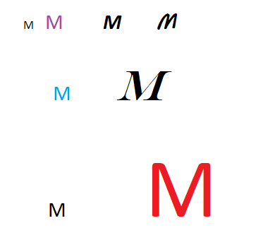
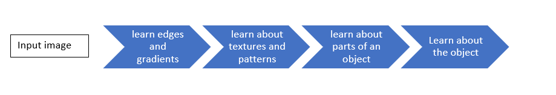

# What are Channels and Kernels (according to EVA)?
Channel is a set which contains all the variations of a single feature at one space. For example, if we consider an alphabet and consider ‘M’ as channel, this channel contains all the variations we can consider as a feature like font size, font style, font colour of ‘M’ alphabet but this channel only belongs to one alphabet that is ‘M’. similarly, if we consider RED colour as a channel, it contains all shades of RED colour like dark red, light red etc. so channel is collection of variations of a single feature.
Kernels are feature extractors or filters or 3*3 (most of the time) randomly initialized matrix, which can be used for convolution with input image/intermediate input to extract the features from image.



# Why should we (nearly) always use 3x3 kernels?
3*3 is an ideal kernel because this kernel is not too larger filter size to ignore the learning of very minute information in a Local receptive field and Not too small filter size which will be heavy in computation power.
Feature extracted from 3*3 filter will be highly local and helps to gather smaller and complex features in an image.

# How many times to we need to perform 3x3 convolutions operations to reach close to 1x1 from 199x199 (type each layer output like 199x199 > 197x197...)
We need 99 convolution operations
```
2.	[199,199]convolve[3,3]=[197,197]
3.	[197,197]convolve[3,3]=[195,195]
4.	[195,195]convolve[3,3]=[193,193]
5.	[193,193]convolve[3,3]=[191,191]
6.	[191,191]convolve[3,3]=[189,189]
7.	[189,189]convolve[3,3]=[187,187]
8.	[187,187]convolve[3,3]=[185,185]
9.	[185,185]convolve[3,3]=[183,183]
10.	[183,183]convolve[3,3]=[181,181]
11.	[181,181]convolve[3,3]=[179,179]
12.	[179,179]convolve[3,3]=[177,177]
13.	[177,177]convolve[3,3]=[175,175]
14.	[175,175]convolve[3,3]=[173,173]
15.	[173,173]convolve[3,3]=[171,171]
16.	[171,171]convolve[3,3]=[169,169]
17.	[169,169]convolve[3,3]=[167,167]
18.	[167,167]convolve[3,3]=[165,165]
19.	[165,165]convolve[3,3]=[163,163]
20.	[163,163]convolve[3,3]=[161,161]
21.	[161,161]convolve[3,3]=[159,159]
22.	[159,159]convolve[3,3]=[157,157]
23.	[157,157]convolve[3,3]=[155,155]
24.	[155,155]convolve[3,3]=[153,153]
25.	[153,153]convolve[3,3]=[151,151]
26.	[151,151]convolve[3,3]=[149,149]
27.	[149,149]convolve[3,3]=[147,147]
28.	[147,147]convolve[3,3]=[145,145]
29.	[145,145]convolve[3,3]=[143,143]
30.	[143,143]convolve[3,3]=[141,141]
31.	[141,141]convolve[3,3]=[139,139]
32.	[139,139]convolve[3,3]=[137,137]
33.	[137,137]convolve[3,3]=[135,135]
34.	[135,135]convolve[3,3]=[133,133]
35.	[133,133]convolve[3,3]=[131,131]
36.	[131,131]convolve[3,3]=[129,129]
37.	[129,129]convolve[3,3]=[127,127]
38.	[127,127]convolve[3,3]=[125,125]
39.	[125,125]convolve[3,3]=[123,123]
40.	[123,123]convolve[3,3]=[121,121]
41.	[121,121]convolve[3,3]=[119,119]
42.	[119,119]convolve[3,3]=[117,117]
43.	[117,117]convolve[3,3]=[115,115]
44.	[115,115]convolve[3,3]=[113,113]
45.	[113,113]convolve[3,3]=[111,111]
46.	[111,111]convolve[3,3]=[109,109]
47.	[109,109]convolve[3,3]=[107,107]
48.	[107,107]convolve[3,3]=[105,105]
49.	[105,105]convolve[3,3]=[103,103]
50.	[103,103]convolve[3,3]=[101,101]
51.	[101,101]convolve[3,3]=[99,99]
52.	[99,99]convolve[3,3]=[97,97]
53.	[97,97]convolve[3,3]=[95,95]
54.	[95,95]convolve[3,3]=[93,93]
55.	[93,93]convolve[3,3]=[91,91]
56.	[91,91]convolve[3,3]=[89,89]
57.	[89,89]convolve[3,3]=[87,87]
58.	[87,87]convolve[3,3]=[85,85]
59.	[85,85]convolve[3,3]=[83,83]
60.	[83,83]convolve[3,3]=[81,81]
61.	[81,81]convolve[3,3]=[79,79]
62.	[79,79]convolve[3,3]=[77,77]
63.	[77,77]convolve[3,3]=[75,75]
64.	[75,75]convolve[3,3]=[73,73]
65.	[73,73]convolve[3,3]=[71,71]
66.	[71,71]convolve[3,3]=[69,69]
67.	[69,69]convolve[3,3]=[67,67]
68.	[67,67]convolve[3,3]=[65,65]
69.	[65,65]convolve[3,3]=[63,63]
70.	[63,63]convolve[3,3]=[61,61]
71.	[61,61]convolve[3,3]=[59,59]
72.	[59,59]convolve[3,3]=[57,57]
73.	[57,57]convolve[3,3]=[55,55]
74.	[55,55]convolve[3,3]=[53,53]
75.	[53,53]convolve[3,3]=[51,51]
76.	[51,51]convolve[3,3]=[49,49]
77.	[49,49]convolve[3,3]=[47,47]
78.	[47,47]convolve[3,3]=[45,45]
79.	[45,45]convolve[3,3]=[43,43]
80.	[43,43]convolve[3,3]=[41,41]
81.	[41,41]convolve[3,3]=[39,39]
82.	[39,39]convolve[3,3]=[37,37]
83.	[37,37]convolve[3,3]=[35,35]
84.	[35,35]convolve[3,3]=[33,33]
85.	[33,33]convolve[3,3]=[31,31]
86.	[31,31]convolve[3,3]=[29,29]
87.	[29,29]convolve[3,3]=[27,27]
88.	[27,27]convolve[3,3]=[25,25]
89.	[25,25]convolve[3,3]=[23,23]
90.	[23,23]convolve[3,3]=[21,21]
91.	[21,21]convolve[3,3]=[19,19]
92.	[19,19]convolve[3,3]=[17,17]
93.	[17,17]convolve[3,3]=[15,15]
94.	[15,15]convolve[3,3]=[13,13]
95.	[13,13]convolve[3,3]=[11,11]
96.	[11,11]convolve[3,3]=[9,9]
97.	[9,9]convolve[3,3]=[7,7]
98.	[7,7]convolve[3,3]=[5,5]
99.	[5,5]convolve[3,3]=[3,3]
100.	[3,3]convolve[3,3]=[1,1]
```
```
for i in range(199,0,-2):
  a = i-2
  print('[{},{}]convolve[3,3]=[{},{}]'.format(i,i,a,a))
```

# How are kernels initialized? 
In DNN Kernels are initialized to random numbers preferably numbers between 0 and 1, 
For ex:
```
kernel = np.random.random((3,3))
output:
[[0.21929182 0.68536291 0.76014199]
 [0.64206209 0.92277252 0.013519  ]
 [0.03209538 0.76502443 0.94132388]]
 ```
also If we are doing some image manipulation operations like edge detections, blurring, pixelizations we can initialize kernels to specific matrix values.
```
kernel = 1/9*np.float32([[1,1,1],[1,1,1],[1,1,1]])
```

# What happens during the training of a DNN?
During the training of DNN in each layer we are learning the features from image and marching towards the building the conclusion of learning


At the initial local receptive fields we learn about edges and gradients, down the line we learn about textures and patterns, and then we learn 
about parts of an object and at the end we will have overall receptive field view and all the information at that layer would have covered and 
learned from our Global receptive filed and predicts the object class  
