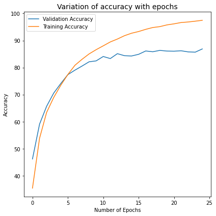
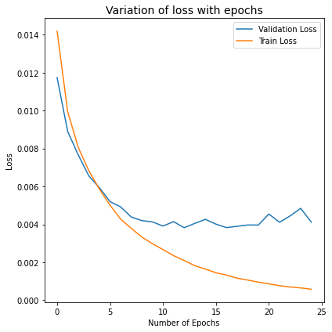
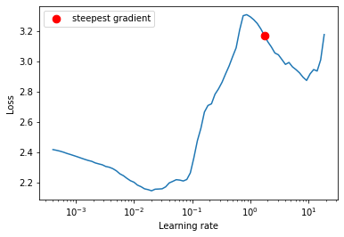
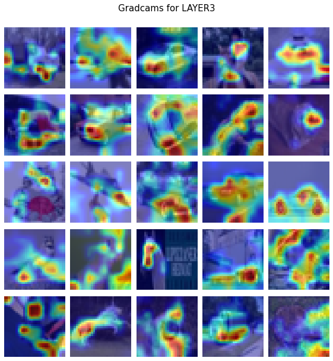
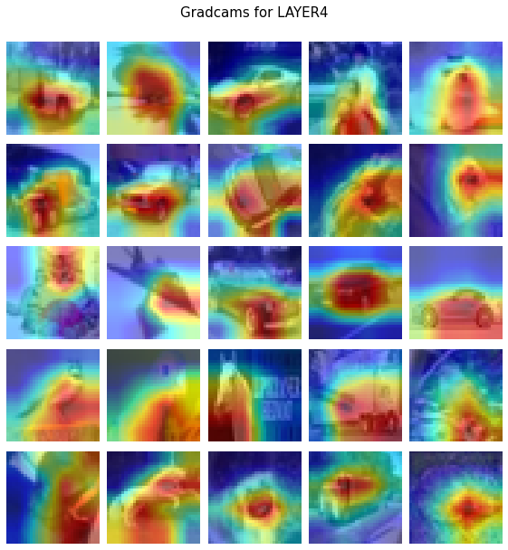
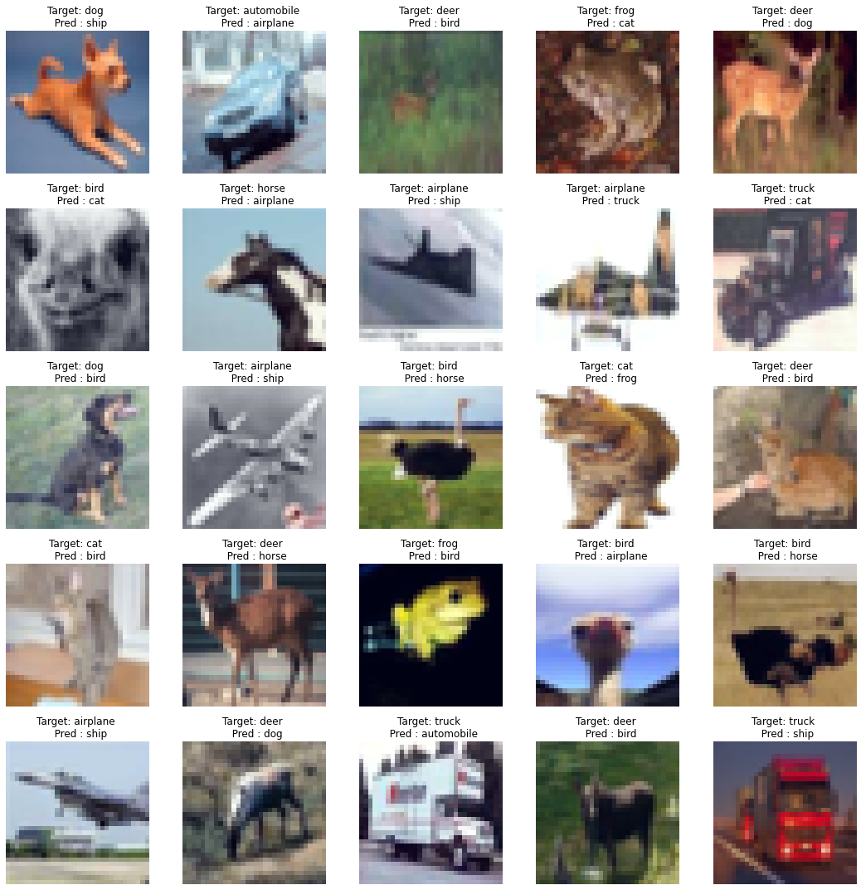

# Session 10 - Advance concepts in training and Learning rates

## Assignment Objective

* Implement cutout the transformation using albumentation package, and make a separate transformation for train and test set
  * train set - HorizontalFlip, cutout, Normalize, ToTensor
  * Test set - Normalize and ToTensor
* Implement LR finder with range test to find out the best LR 
* implement ReduceLROnPlatea

Gradcam for visualization of focus of our trained network. and generate a batch gradcam for visulaization of 25 images together.
  

## Solution:

* Used cutout with size (8,8) transformation.
* Implemented the LR finder with range test
* implemented ReduceLROnPlatea sheduler

## Results

 * Achived expected validation accuracy

## Accuracy and Loss
 

## LRfinder with range test

## Gradcam cam result for layers

## 25 misclassified images

