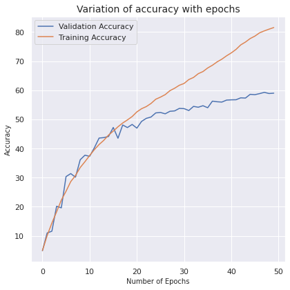
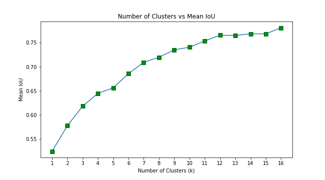
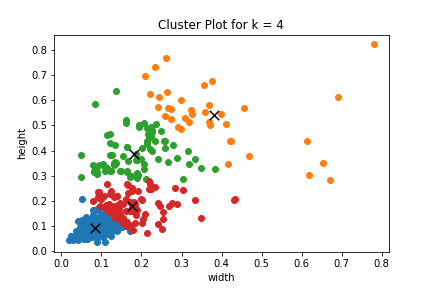
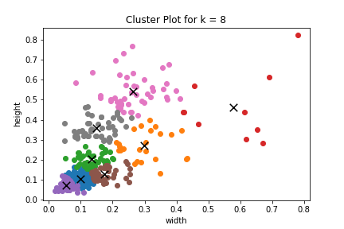
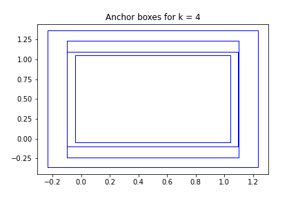
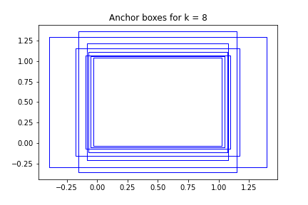

# Session 12 - Object localization YOLO

## Assignment Objective
* train ResNet18 on the tiny imagenet dataset [download](http://cs231n.stanford.edu/tiny-imagenet-200.zip)
* Target >50% Validation Accuracy with 50 epochs
* Download 50 (min) images each of people wearing hardhat, vest, mask and boots.Use these labels (same spelling and small letters):
  - hardhat
  - vest
  - mask
  - boots
* Describe the contents of this JSON file in FULL details. 
* Find out the best total numbers of clusters

## Results of taring ResNet18 model with tiny imagenet dataset
 * ResNet18 model is trained with tiny imagenet dataset with 50 epochs and achieved the >50% val accuracy.
 * OneCycleLR sheduler is used:
   - min_lr = 0.5
   - max_lr = min_lr/5
   - Epochs = 24
   - Batch Size = 512
 * Achived expected validation accuracy of **50%**
 * transform used: Randomcrop-->flip-->Rotation

## Accuracy and Loss

## Annotation of images for PPE detection.
* Downloaded abput 64 images each of people wearing hardhat, vest, mask and boots.
* Images are anootaed with bounding box for classes.
  - hardhat
  - vest
  - mask
  - boot
* tool used for annotation - [VIA](http://www.robots.ox.ac.uk/~vgg/software/via/via_demo.html) 
## Kmeans IOU for diffrent k values of clustering

* For the above plot, k = 4 or k = 8 seems to be the best choice because for after 8, the curve becomes almost linear.

## Cluster plot for k=4 and k=8
 

## Anchor box for k=4 and k=8
 
