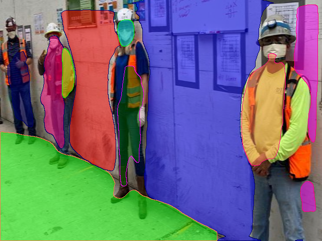

# Seeion13: RCNN Family: RCNN, Fast-RCNN, FasterRCNN & MaskRCNN

## Objectives of the session:
* Try and understand the MiDaS and planercnn implementation and run them to generate depteh images and planer images for our PPE dataset.
  - [MiDaS](https://github.com/intel-isl/MiDaS)
  - [PlaneRCNN](https://github.com/NVlabs/planercnn)

## Link to the gdrive for PPE dataset with 
* bounding box annotations
* Depth images
* Planer images \
[Gdrive link](https://drive.google.com/drive/folders/1wIyFR9FXc6LakBt3xoYTvdWqBUvezjlH?usp=sharing)

# Running MiDas repo to get depth images.
* Place one or more input images in the folder `input`
* Run the model: \
`python run.py`

## sample output

# Running planercnn repo to get planer images
* open the google colab file and select GPU runtime
* Istall the cuda 8 and and gcc 5, everything is taken care by shell file 'planercnn_cuda.sh'
`!bash planercnn_cuda.sh`
* Place one or more input images in the folder `input` and also place camera.txt file in the same folder
* Run the evaluate file \
`python evaluate.py --methods=f --suffix=warping_refine --dataset=inference --customDataFolder=input`

## sample output

